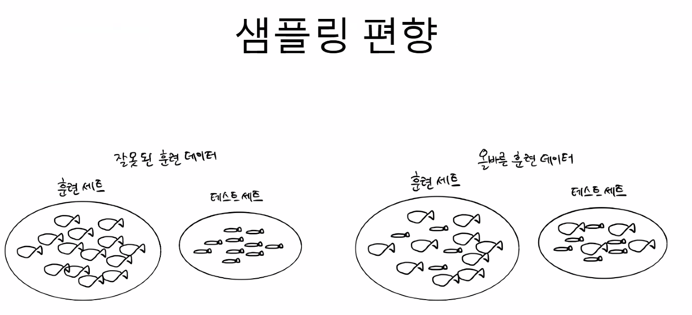

# iot-dataanalysis-2025
2025 IoT 개발자과정 빅데이터분석 리포지토리

## 1일차

### 머신러닝 / 딥러닝 

(출처 : EVIDIA)

- 인공지능(Artifical Intelligence: AI)의 분야
    - 컴퓨터가 사람의 행동을 흉내내는 모든 기술

- 머신러닝
    - 인공지능 하위 집합
    - 통계적인 방법을 이용, 기계를 학습시키는 인공지능 기술

- 딥러닝
    - 머신러닝의 하위 집합
    - 신경망 기술을 이용, 머신러닝 기술 중 하나

- 인공지능 역사
    - 1943 - 월터 피츠, 워랜 맥컬러가 MCP뉴런
    - 1950 - 튜링(엘런 튜닝) 테스트, 인공지능 테스트
    - 1957 - 퍼셉트론 이론
    - 1974 - 1차 AI겨울 . 컴퓨터 성능 한계
    - 1980 - AI붐. 전문가 시스템(머신러닝)
    - 1987 - 2차 AI 겨울. 전문가시스템 실패
    - 2010 - 컴퓨터 HW환경 비약적 발전. AI희망
    - 2015 - 텐서플로 발표
    - 2016 - 알파고

### 개발환경

#### 코랩
- Google Colaboratory
- 구글에서 만든 온라인 주피터노트북 개발 플랫폼
- 구글 드라이브 연동, 구글 서버 하드웨어 사용
    - 드라이브 ColabNotebooks 폴더에 저장
- 어디서나 파이썬 학습, 개발 등 가능
- https://colab.research.google.com/?hl=ko
- 런타임 유형
    - CPU, T4 , GPU, v2-8 TPU - 무료
    - A1000 GPU, L4 GPU, v5e-1 TPU - 유료
- 무료에서는 80분 넘게 사용시 세션이 끊어짐

#### VSCode
- 로컬 직접 환경 설정
- 사이킷런, 텐서플로, 쿠다, 파이토치...

#### 파이썬 가상환경
- 가상환경 생성 명령어 (원본은 건드리지말고 환경을 새로 만들어씀)
```shell
> python - mvenv mlvenv
```
- 가상환경 사용
```shell
> .\mlvenv\Scripts\activate

(mlvenv) PS C:\Source\iot-dataanalysis-2025> 
```
- .gitignore에 /mlvenv 추가 GitHub 우선 Commit Push (중요! 안해주면 수천개 들어감)

- 맷플롯립(Matplotlib) 설치
```shell
> pip install matplotlib

[notice] A new release of pip is available: 24.0 -> 25.0.1
[notice] To update, run: python.exe -m pip install --upgrade pip
```
- 맷플롯립 한글 설정
```python
from matplotlib import rcParams, font_manager, rc

font_path = 'C:/Windows/Fonts/NanumGothicCoding.ttf' # 나눔고딕코딩 사용, 나눔고딕에서 오류발생(!)
font = font_manager.FontProperties(fname=font_path).get_name() # 실제 설치된 폰트 이름조회
rc('font', family=font) # 한글깨짐현상 해결!!
rcParams['axes.unicode_minus'] = False # 한글 사용시 마이너스 표시 깨짐 해결!
```

- 시본(Seaborn) 모듈(맥플롯립 하위 모듈) 설치 
```shell
> pip install seaborn
```


- 사이킷런(Sklearn) 설치

```shell
> pip install scikit-learn
```

- 텐서플로(Tensorflow) 설치
```shell
> pip install tensorflow==2.15.0

```

### 첫번째 머신러닝
- 캐글 생선 데이터
    - https://www.kaggle.com/datasets/vipullrathod/fish-market

- 길이를 보고 도미(bream)인지 빙어(smelt)인지 판별
- 이진 분류(Binary Classification)


- [노트북](./day01/mldl01_도미빙어분류.ipynb)

### 지도 학습 / 비지도 학습
- 지도 학습(Supervised Learn) -> 데이터 -> `입력`, 정답 -> `타겟` => 훈련 데이터(training data)
    - 입력 - 특성(길이 , 무게, ...)
    - 입력과 타겟을 모두 주어서 훈련 시키는 것

- 비지도 학습(UnSpervised Learn) - 입력만 존재하고 타겟이 없이 훈련하는 것

- 강화 학습(Reinforcement Learn) - 선택가능한 행동 중 보상 처벌 등으로 최적의 행동양식 학습을 하는 것.


| 학습 종류   | 정답 라벨 유무     | 학습 방식                              | 예시                                  |
|------------|--------------------|----------------------------------------|---------------------------------------|
| 지도학습   |  있음             | 입력과 정답을 같이 주고 학습함         | 고양이 vs 강아지 분류, 스팸 메일 분류 |
| 비지도학습 |  없음             | 정답 없이 데이터에서 패턴을 찾음       | 고객 세분화, 문서 클러스터링          |
| 강화학습   |  직접적 정답은 없음 | 행동에 따라 보상을 주며 스스로 학습함 | 게임 AI, 로봇 제어, 자율주행          |
```
지도학습: "정답 알려줄게, 이대로 배워!"

비지도학습: "정답은 없어, 패턴은 네가 찾아봐~"

강화학습: "행동해보고 보상 받으면서 배워봐!"
```

#### 훈련 세트 / 테스트 세트
- `훈련` 세트 - 모델을 훈련시키기 위한 데이터
- `테스트` 세트 - 훈련 후 모델이 예측을 제대로 하는지 테스트를하는 데이터

- 전체 데이터 70 ~ 80 분리 후 훈련 세트로, 20 ~ 30 퍼센트를 테스트 세트 사용 

#### 샘플링 편향
- 49개 데이터를 7:3 으로 분리하면 
    - 34 마리가 전부 도미로 훈련 세트
    - 1마리 도미 + 14마리 빙어빙어로 테스트 세트

- 위 문제를 헤결하기 위해서 데이터를 랜덤하게 섞어 줌


#### 넘파이
- 수학 라이브러리의 일종. 파이썬에서 베열처리 쉽게 도와주기 위해 개발
- 2차원 배열이상 고차원 배열 조작 처리 간편한 도구 

- [노트북](./day01/mldl02_훈련테스트세트.ipynb)


## 2일차

### 빅데이터에 필요한 모듈
- Matplotlib(차트), Seaborn(차트꾸미디), Numpy(배열)
- Pandas(데이터 조작), Folium(지도), Faker(더미데이터 조작)

- [노트북](./day02/mldl01_주요모듈학습.ipynb)

### 데이터 전처리
- 머신러닝/딥러닝 이전에 데이터 가공

### 선형회귀

### 로지스틱회귀

### 확률적 경사하강법

### 인공신경망

### 심층신경망

### 합성곱신경망


## 8일차
    
### 코딩테스트


